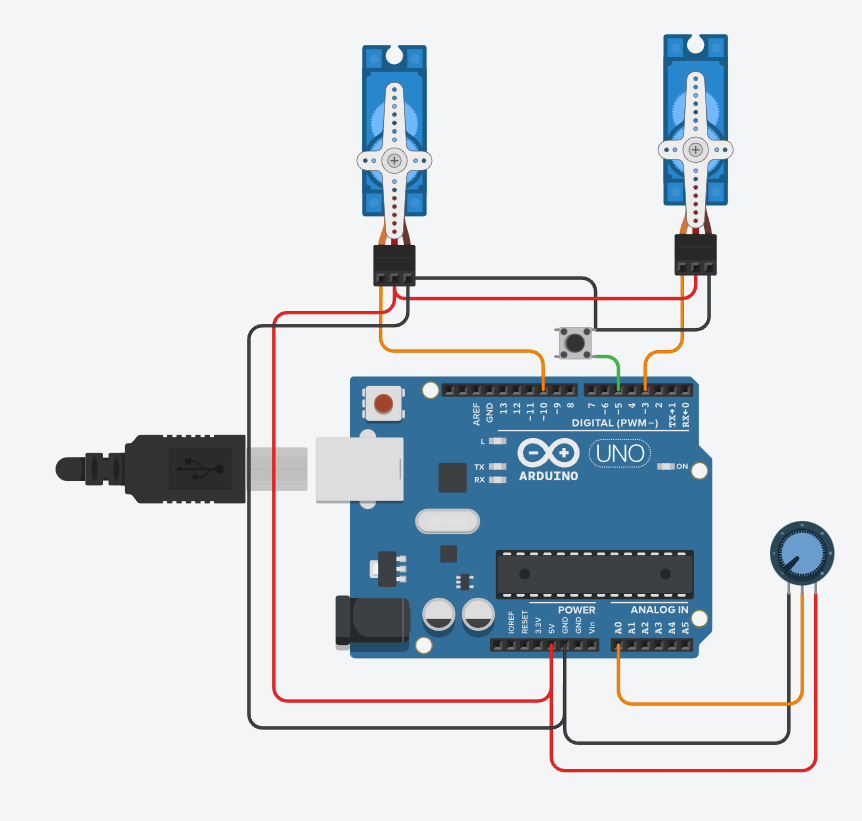

# DE2_Project

### Team members

* Tomáš Dočkal (Code for driving servo motor, README file)
* Tran Minh Hieu (Code for driving servo motor, translating ADC value for servomotor)

## Hardware description

### Driving servo motors using PWM channels.

Allows to control two servo motors using a potenciometer and a button. Pressing the button changes which motor is being cotrolled, rotating the potenciometer then changes angle of the motor.

### Components used:

Arduino uno

servo motors

potenciometer

button

### Schmeatic

 

## Software description

### Stucture of the project
   ```c
   Project                        // PlatfomIO project
   ├── include                    // Included files
   │   └── timer.h                // Timer library for AVR-GCC includes definitions for Timers/Counters
   ├── lib                        // Libraries
   │   └── GPIO                   // GPIO library for AVR-GCC used for reading/writing digital pins
   |       ├── gpio.c             
   |       └── gpio.h                  
   ├── src                        // Source file(s)
   │   └── main.c
   └── platformio.ini             // Project Configuration File
   README.md                      // Report of this project
   images
   ```
   
 ### Flowcharts
   
#### [flowchart of Timer0 interupt](Images/Flowchart_P2_T0.png)
 Responsible for switching between which servo is being controlled.
 
#### [flowchart of ADC interrupt](Images/Flowchart_P2_ADC.png)
 Responsible for converting analog input into OCR2x value for servomotor

 
## Video

https://user-images.githubusercontent.com/99402754/208309075-6bdf6ee2-fbad-4bc1-97f0-acdb17a97854.mov

## References

1. Needed libraries from https://github.com/tomas-fryza/digital-electronics-2
2. Function for OCR2A/OCR2B https://deepbluembedded.com/map-function-embedded-c/
