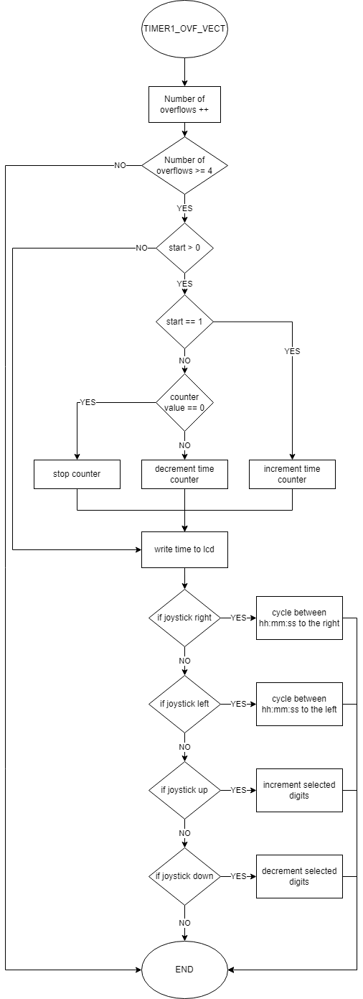
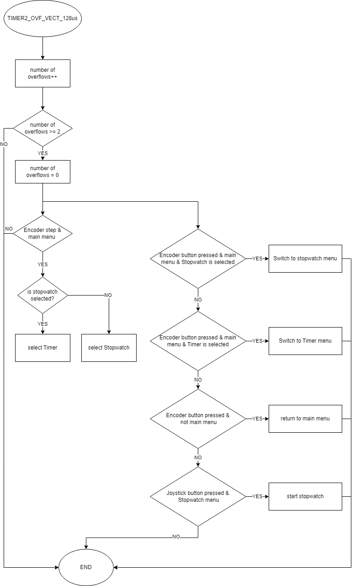
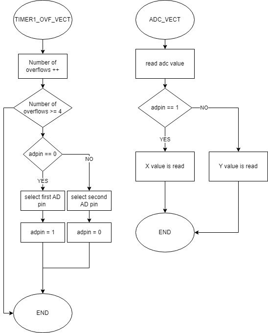

# DE2_Projekt

### Team members

* Tomáš Dočkal (responsible for Code for Menu and Timer fucstions)
* Tran Minh Hieu (responsible for Code for Menu, Timer and Stopwatch functions)

## Hardware description

Insert descriptive text and schematic(s) of your implementation.

Stopwatch and alarm clock.

Enables you to choose between stopwatch which counts up each second up to 100 hours and alarm clock (timer) which lets you set a time after which a LED will turn on.

Components used:

Arduino uno

Display HD44780U LCD

Encoder ...

Joystick ...

 

## Software description

Put flowchats of your algorithm(s). Write descriptive text of your libraries and source files. Put direct links to these files in `src` or `lib` folders.

   ```c
   Project                        // PlatfomIO project
   ├── include                    // Included files
   │   └── timer.h                // Timer library for AVR-GCC
   ├── lib                        // Libraries
   │   ├── GPIO                   //
   |   |   ├── gpio.c             // library for AVR-GCC
   |   |   └── gpio.h             // include file for the GPIO GPIO library for AVR-GCC
   │   ├── lcd                    //
   |   |   ├── lcd.c              // HD44780U LCD library
   |   |   ├── lcd.h              // include file for the HD44780U LCD library
   |   |   └── lcd_definitions.h  // Definitions for Display Size
   │   └── uart                   //
   |       ├── uart.c             // Interrupt UART library with receive/transmit circular buffers
   |       └── uart.h             // Interrupt UART library with receive/transmit circular buffers
   ├── src                        // Source file(s)
   │   └── main.c
   ├── platformio.ini             // Project Configuration File
   └── README.md                  // Report of this project
   ```
   
 
 
 
## Video

Insert a link to a short video with your practical implementation example (1-3 minutes, e.g. on YouTube).

## References

1. Inspiration for Encoder code from: https://howtomechatronics.com/tutorials/arduino/rotary-encoder-works-use-arduino/
2. ...
